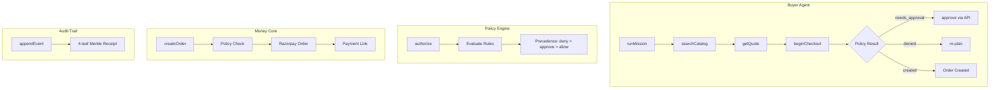

# AgentTill

> Autonomous buyer agent with deterministic policy gate for the Razorpay Buildathon (Track 01).

```
+-------------------+     +------------------+     +-------------------+
|  Buyer Agent      |---->|  Policy Engine   |---->|  Razorpay API     |
|  (HTTP tools)     |     |  (deny/approve)  |     |  (test mode)      |
+-------------------+     +------------------+     +-------------------+
         |                        |                        |
         v                        v                        v
   +-------------------+   +------------------+   +-------------------+
   |  Catalog/Quote    |   |  Append-Only     |   |  Webhooks         |
   |  SQLite           |   |  Audit Trail     |   |  (HMAC-SHA256)    |
   +-------------------+   +------------------+   +-------------------+
```

## Quickstart

```bash
# Clone and install
bun install

# Configure Razorpay test keys
cp .env.example .env
# Edit .env with your rzp_test_* keys from https://dashboard.razorpay.com/app/test/keys

# Seed database
bun run seed

# Run demo mission (agent searches catalog, creates cart, triggers approval)
bun run demo

# Start server for dashboard/API
bun run dev
```

## Demo Output

```
━━━━━━━━━━━━━━━━━━━━━━━━━━━━━━━━━━━━━━━━━━━━━━━━━━━━━━━━━━━━
  AgentTill Demo Mission — Track 01
━━━━━━━━━━━━━━━━━━━━━━━━━━━━━━━━━━━━━━━━━━━━━━━━━━━━━━━━━━━━
Intent:  restock: notebooks, markers, coffee
Budget:  ₹2000.00
...
Agent Result:
Status:     needs_approval
Approval:   apr_xxxxxxxx
Pay:        https://razorpay.com/pay/...

Dashboard:  http://localhost:3000/dashboard.html
```

## Architecture



## Policy Rules

| Rule | Threshold | Behavior |
|------|-----------|----------|
| `max_basket_value` | ₹2,500 | Denies cart > limit |
| `hourly_spend_cap` | ₹5,000 | Denies if trailing-hour spend + cart > cap |
| `velocity_max_checkouts_per_hour` | 4 | Denies if >4 checkouts in trailing hour |
| `category_allowlist` | — | Denies SKUs in `catering` category |
| `approval_above` | ₹1,000 | Gates cart > ₹1,000 for human approval |
| `mission_budget` | Mission budget | Denies cart exceeding mission budget |
| `mandate_ceiling` | Buyer mandate | Denies exceeding buyer's spend limit |

## Where AI Is/Isn't Used

**AI Controls:**
- Mission intent parsing (simple keyword extraction)
- Cart selection from search results
- Retry/backoff logic on failures

**AI Never Touchs:**
- Policy decisions (deterministic rules)
- Money arithmetic (integer paise only)
- Razorpay API calls (single authorized module)
- Webhook signature verification (timing-safe HMAC)
- Audit trail construction (append-only, Merkle-verified)

## Failure Modes

| Scenario | Behavior | Recovery |
|----------|----------|----------|
| Card decline (`failure@razorpay`) | Mission → FAILED, then RETRYING | Auto-retry with exponential backoff |
| Quote→order mismatch | Hard stop before order creation | Cart re-priced from catalog |
| Policy denial | Mission → REJECTED, agent re-plans | Agent retries with smaller cart |
| Webhook tampering | 401 rejected, zero state change | Valid signature required |
| Duplicate webhook | Idempotent processing | Only first event executes |
| Two failed retries | Mission → ESCALATED | Human approval required |

## Dashboard

Open `http://localhost:3000/dashboard.html` to view:
- Mission list with status
- Audit timeline per mission
- Approval queue with one-click resolve

## File Structure

```
src/
├── agent/
│   ├── agent.js      # Buyer agent loop (3 retries, backoff)
│   ├── tools.js      # HTTP client wrappers
│   └── prompts.js    # Agent system prompt
├── audit.js          # Append-only event store
├── approvals.js      # Human-in-the-loop gate
├── catalog.js        # 14 products, 4 categories
├── config.js         # Zod-validated environment
├── db.js             # SQLite schema + CRUD
├── mand

ates.js     # Buyer spend limits
├── merkle-receipt.js # 4-leaf Merkle tree for tamper-evident logs
├── missions.js      # State machine (PLANNING → CONFIRMED)
├── money-actions.js # createOrder, confirmPayment, retry, refund
├── policy-engine.js # Deterministic authorization
├── policy-rules.js  # 6 rule definitions
├── razorpay-client.js # Official SDK wrapper
├── routes.js        # REST API endpoints
├── server.js        # Express app
└── webhooks.js      # HMAC-verified webhook handlers
```

## Test Suite

```bash
bun test        # 33 tests, 82 assertions
```

All tests pass without mocking the Razorpay SDK (stubs verify no unintended API calls).

## License

MIT — built for the Razorpay Buildathon Track 01.