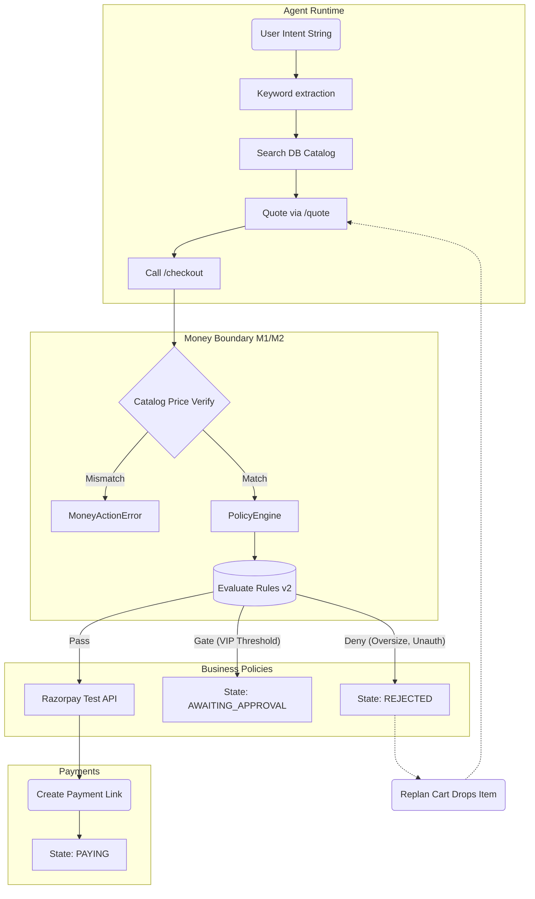

# AgentTill

AgentTill is an autonomous buyer agent that manages procurement missions, handles multi-attempt checkouts via Razorpay, strictly enforces business spending policies, and provides a fully immutable Merkle-tree audit trail for all transactions.

## Features

- **Decoupled Autonomous Agent**: Runs a 12-iteration loop extracting keyword intents, mapping them to SKUs, generating quotes, and driving the checkout process.
- **Plurality & Similarity Handling**: Smoothly extracts base intents from natural language (e.g., "notebooks" -> "notebook").
- **Smart Re-planning**: When policies deny a checkout (e.g., "Max cart volume reached"), the agent iteratively trims the cart and requotes to find policy-compliant arrangements automatically.
- **Isolated Payment Layer**: Agent operates independently of the `money-actions.js` M1/M2 boundary logic preventing hallucinations from interacting with the critical payment layer.
- **Human In the Loop (HITL)**: Policies requiring manual override push the mission into `AWAITING_APPROVAL`. The agent suspends. Admins approve/deny via `/approvals/:id/approve`, allowing the agent to seamlessly resume.
- **Idempotency & Cryptographic Auditing (Phase 5/6)**: Every action drops immutable rows into `audit_events`. High-stakes transitions generate a 4-leaf cryptographic receipt (Merkle root matching the state).

## Run Locally

### Requirements
- [Bun v1.2+](https://bun.sh/)
- Razorpay API Test Mode keys.

### Start Up

```bash
git clone https://github.com/SajagIN/agent-till.git
cd agent-till
bun install
```

Configure environment:
```bash
cp .env.example .env
# Edit .env with your Razorpay Test Key and Secret
```

Start the system (Demo mode seeds the database and starts the express server and agent execution):
```bash
bun scripts/demo-mission.js
```

## Architecture Map



## AI Boundaries & Security
To prevent catastrophic overspending or hallucinated pricing, AgentTill explicitly draws lines around what AI is allowed to do.

| Component | Is AI Involved? | Explanation |
|---|---|---|
| **Intent Parsing** | Yes | Extracting shopping constraints ("I need pens and markers") from natural languages. |
| **Catalog Lookup** | Yes | The agent maps its extracted constraints to actual DB items via the API proxy. |
| **Pricing/Quoting** | **No** | Server-side boundaries (M2) retotal the cart from the DB. |
| **Policy Evaluation** | **No** | Deterministic business rules (budget tracking, category blocks, velocity) strictly govern checkpoints. |
| **Razorpay Calls** | **No** | Completely isolated to `money-actions.js`. |

## Business Policy Rules

| Rule ID | Type | Action | Description |
|---|---|---|---|
| `mandate_ceiling` | Deny | `create_order` | Blocks single carts > ₹50,000. |
| `max_basket_value` | Deny | `create_order` | Blocks unapproved purchases based on dynamic logic. |
| `hourly_spend_cap` | Deny | `create_order` | Hard caps total agent spend within a sliding 60-minute window (₹20,000) using audit history. |
| `velocity_limit` | Deny | `create_order` | Prevents the agent from creating more than 4 checkouts in an hour. |
| `category_allowlist` | Deny | `create_order` | Ensures procured SKUs match allowed B2B MCC codes (e.g. no "software_subscriptions" if unapproved). |
| `approval_above` | Gate | `create_order` | Checkouts exceeding ₹1,000 silently pause the mission and request manual HTTP token approval. |
| `mission_budget` | Deny | `create_order` | Agent carts cannot exceed the hard ceiling defined in the mission intent. |

## Failure Playbook & Policies
For extensive information on Error Classes, SDK Throttle handling (HTTP 429), and State Lock, read `docs/failure-playbook.md`.

## Incident Log Teaser
During deployment, building deterministic AI requires acknowledging fail states:
> *Incident 001 - The Agent hallucinated plural strings (`markers` vs `marker`) creating a Zero-Match state causing it to return early.*
> *Incident 002 - Agent attempted a `REJECTED -> QUOTED` transition sequentially over the rate limit after stripping the cart too aggressively. Added transition allowance and retry-limits to `missions.js`.*
> *Incident 003 - `import.meta.url` checking failed during Windows process spawn. Resolved using `fileURLToPath` standardizations.*

*(See full incident log in the repository)*
