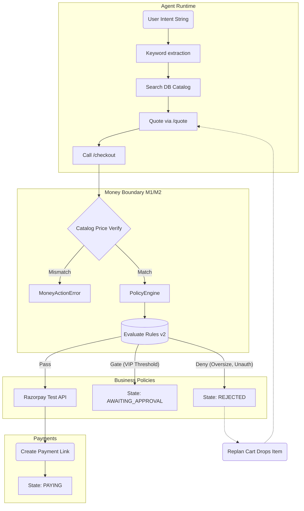

# AgentTill

AgentTill is an autonomous buyer agent that manages procurement missions, handles multi-attempt checkouts via Razorpay, strictly enforces business spending policies, and provides a fully immutable Merkle-tree audit trail for all transactions.

## Features

- **Decoupled Autonomous Agent**: Runs a 12-iteration loop extracting keyword intents, mapping them to SKUs, generating quotes, and driving the checkout process.
- **Plurality & Similarity Handling**: Smoothly extracts base intents from natural language (e.g., "notebooks" -> "notebook").
- **Smart Re-planning**: When policies deny a checkout (e.g., "Max cart volume reached"), the agent iteratively trims the cart and requotes to find policy-compliant arrangements automatically.
- **Isolated Payment Layer**: Agent operates independently of the `money-actions.js` M1/M2 boundary logic preventing hallucinations from interacting with the critical payment layer.
- **Human In the Loop (HITL)**: Policies requiring manual override push the mission into `AWAITING_APPROVAL`. The agent suspends. Admins approve/deny via `/approvals/:id/approve`, allowing the agent to seamlessly resume.
- **Idempotency & Cryptographic Auditing (Phase 5/6)**: Every action drops immutable rows into `audit_events`. High-stakes transitions generate a 4-leaf cryptographic receipt (Merkle root matching the state).

## Run Locally

### Requirements
- [Bun v1.2+](https://bun.sh/)
- Razorpay API Test Mode keys.

### Start Up

```bash
git clone https://github.com/SajagIN/agent-till.git
cd agent-till
bun install
```

Configure environment:
```bash
cp .env.example .env
# Edit .env with your Razorpay Test Key and Secret
```

Start the system (Demo mode seeds the database and starts the express server and agent execution):
```bash
bun scripts/demo-mission.js
```

## Architecture Map



## Failure Playbook & Policies
For information on policy definitions, error handling, rate limits, and transition boundaries, read `docs/failure-playbook.md`.
